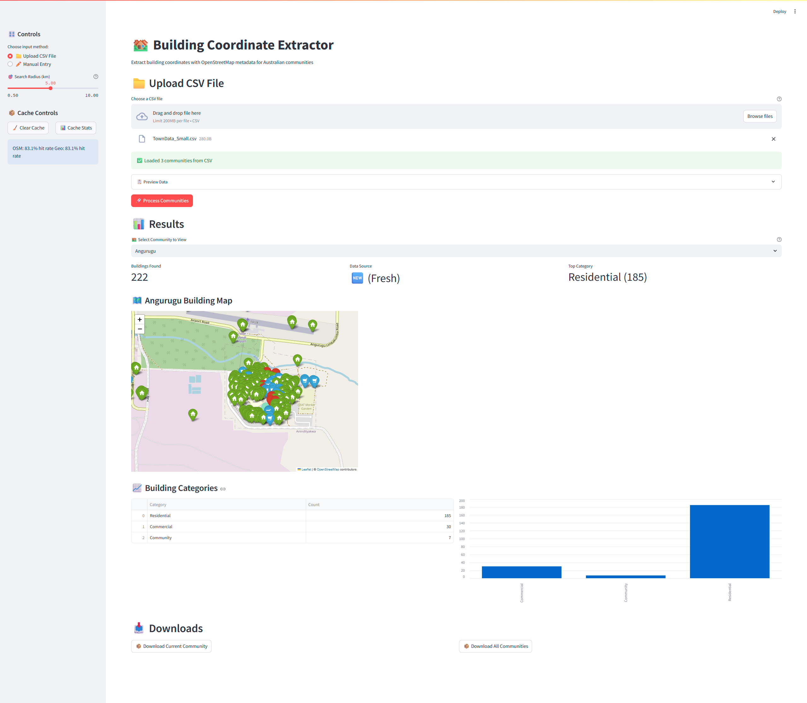
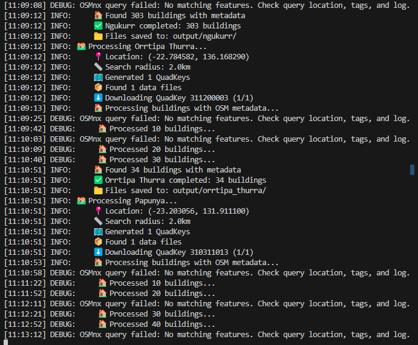
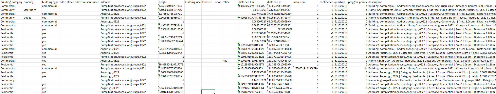

# 🏘️ Building Coordinate Extractor

**Extract building coordinates with OpenStreetMap metadata for Australian communities**

A comprehensive tool that combines Microsoft Global Building Footprints with OpenStreetMap data to provide detailed building information for community planning, particularly Starlink coverage analysis for remote Australian communities.

[](https://www.python.org/downloads/)
[](https://streamlit.io/)
[](https://opensource.org/licenses/MIT)

## 🎯 Features

### **📊 Data Sources**
- **Microsoft Global Building Footprints**: High-accuracy building geometries
- **OpenStreetMap**: Rich metadata (names, amenities, addresses, building types)
- **Nominatim Geocoding**: Address lookup for building locations

### **🖥️ Interface Options**
- **🖱️ Streamlit Web App**: Beautiful, interactive web interface
- **⌨️ Command Line**: Batch processing for automation workflows
- **📁 Dual Input**: Upload CSV files or enter single communities manually

### **🚀 Smart Performance**
- **⚡ Intelligent Caching**: 10x faster re-runs with automatic cache management
- **📊 Real-time Progress**: Granular progress tracking with dual progress bars
- **🔄 Resume Capability**: Process interruptions won't lose previous work

### **🏗️ Building Classification**
- **🟢 Residential**: Houses, apartments, cabins (Green markers)
- **🔴 Community**: Schools, hospitals, churches (Red markers)  
- **🔵 Commercial**: Shops, offices, warehouses (Blue markers)

### **📤 Output Formats**
- **📄 CSV**: For coverage planning software integration
- **🗺️ KML**: For Google Earth visualization and validation
- **📋 Summary**: Detailed reports with statistics and recommendations
- **📦 ZIP Downloads**: Convenient packaging for sharing

## 📸 Screenshots

### Streamlit Web Interface

*Streamlit Web Interface*



*Terminal Progress*

 

*Google Earth Interactive Map*


*CSV Export*




## 🚀 Quick Start

### **Installation**

1. **Clone or Download Project Files**
   ```bash
   git clone https://github.com/Jack-B-Hall/BuildingDetector.git building-extractor
   cd building-extractor
   ```

2. **Install Dependencies**
   ```bash
   pip install -r requirements.txt
   ```

3. **Run Streamlit App**
   ```bash
   streamlit run streamlit_app.py
   ```
   
   Or use the demo launcher:
   ```bash
   python run_demo.py
   ```

### **Command Line Usage**

```bash
# Process all communities from CSV
python town_extract.py --batch

# Process single community  
python town_extract.py --lat -12.324 --lon 133.056 --distance 2 --name "Gunbalanya"

# Clear cache when needed
python town_extract.py --clear-cache
```

## 📁 Project Structure

```
building-extractor/
├── 📱 Web Interface
│   ├── streamlit_app.py              # Main Streamlit application
│   └── run_demo.py                   # Quick launcher script
│
├── ⌨️ Command Line
│   └── town_extract.py   # CLI batch processor
│
├── 🧩 Core Modules  
│   ├── app/utils.py                  # Utility functions & XML escaping
│   ├── app/cache_manager.py          # Smart caching system
│   ├── app/microsoft_data.py         # Microsoft building data processing
│   ├── app/osm_integration.py        # OpenStreetMap metadata integration
│   └── app/output_generators.py      # CSV, KML, and report generation
│
├── 📄 Configuration
│   ├── requirements.txt              # Python dependencies
│   ├── TownData.csv                  # Sample community data
│   └── README.md                     # This file
│
├── 📁 Generated Data
│   ├── output/                       # Processed community results
│   │   ├── community_name/
│   │   │   ├── community_name_buildings.csv
│   │   │   ├── community_name_buildings.kml
│   │   │   └── community_name_summary.txt
│   │   └── batch_summary_report.txt
│   │
│   ├── cache/                        # Performance cache
│   │   ├── osm_metadata.json        # OSM building metadata
│   │   ├── geocoding.json           # Address lookups
│   │   └── buildings.pickle         # Complete building datasets
│   │
│   └── temp_buildings/               # Temporary QuadKey files (auto-deleted)
```

## 📋 CSV Input Format

Your CSV file should contain these columns:

### **Required Columns:**
- `Community Name` (or `town_name`, `name`)
- `Latitude` (or `latitude`, `lat`) 
- `Longitude` (or `longitude`, `lon`)

### **Optional Columns:**
- `distance_km` (search radius, otherwise uses app setting)
- `State`, `LGA`, `ABS Remoteness`, `AGIL CODE` (preserved in output)

### **Example CSV:**
```csv
AGIL CODE,Community Name,Latitude,Longitude,State,LGA,ABS Remoteness
16MI,16 Mile Camp,-23.45764,133.83248,NT,MacDonnell,Remote Australia
GILN,Alkupitja,-23.06533,133.69436,NT,MacDonnell,Remote Australia
ANGU,Angurugu,-13.9822,136.4606,NT,East Arnhem,Very Remote Australia
HERM,Hermannsburg,-23.9417,132.7697,NT,MacDonnell,Remote Australia
```

## 🎛️ Usage Guide

### **Streamlit Web App**

1. **📁 Upload CSV or ✏️ Manual Entry**
   - Upload your community CSV file, or
   - Enter single community details manually

2. **🎯 Set Search Radius**
   - Use slider to select 0.5km - 10km radius
   - 2km recommended for most communities

3. **🚀 Process Communities**
   - Click "Process Communities" button
   - Watch real-time progress with detailed updates

4. **🗺️ Explore Results**
   - Select community from dropdown
   - View interactive map with color-coded buildings
   - Analyze category breakdowns and statistics

5. **📦 Download Results**
   - Download current community or all communities
   - Get ZIP files with CSV, KML, and summary files

### **Command Line Interface**

```bash
# Batch processing with default settings
python town_extract.py --batch --verbose

# Custom input file and search radius
python town_extract.py --batch --input my_communities.csv --default-distance 5

# Single community processing
python town_extract.py \
  --lat -23.45764 \
  --lon 133.83248 \
  --distance 3 \
  --name "16 Mile Camp"

# Cache management
python town_extract.py --clear-cache
python town_extract.py --batch --no-cache  # Fresh data
```

## ⚡ Performance & Caching

### **Cache Benefits**
- **First Run**: Normal speed (builds comprehensive cache)
- **Re-runs**: ⚡ ~10x faster using cached data
- **Mixed Runs**: Fast for cached areas, normal for new areas
- **Auto-Expiry**: Cache expires after 30 days automatically

### **Cache Statistics**
```bash
📦 Cache Performance:
OSM metadata hit rate: 89.3%
Geocoding hit rate: 94.7% 
Building area hit rate: 67.2%
```

### **Performance Tips**
- ✅ **Start Small**: Test with 1-2 communities first
- ✅ **Optimal Radius**: 2km works well for most remote communities
- ✅ **Use Cache**: Don't clear cache unless data seems outdated
- ✅ **Batch Processing**: Upload CSV for multiple communities

## 🛠️ Technical Details

### **Data Processing Pipeline**
1. **QuadKey Generation**: Convert lat/lon + radius to Microsoft QuadKey tiles
2. **Data Download**: Fetch Microsoft building footprint files
3. **Geometry Processing**: Extract building centroids and calculate areas  
4. **OSM Enhancement**: Enrich with OpenStreetMap metadata
5. **Geocoding**: Add address information via Nominatim
6. **Classification**: Categorize buildings as Residential/Community/Commercial
7. **Output Generation**: Create CSV, KML, and summary files

### **Building Categories**

| Category | Indicators | Color | Examples |
|----------|------------|-------|----------|
| 🟢 **Residential** | `house`, `residential`, `apartments` | Green | Houses, cabins, dormitories |
| 🔴 **Community** | `school`, `hospital`, `place_of_worship` | Red | Schools, churches, clinics |
| 🔵 **Commercial** | `shop`, `office`, `commercial` | Blue | Stores, offices, warehouses |

### **Output File Details**

**CSV Files:**
- `building_id`, `latitude`, `longitude`, `name`, `building_category`
- `amenity`, `building_type`, `address`, `height`, `area_sqm`
- `distance_km`, `confidence`, `description` (aggregated metadata)

**KML Files:**
- Color-coded markers by building category
- Detailed popups with all metadata
- Search center and radius circle
- Organized into folders by category

**Summary Files:**
- Community statistics and category breakdowns
- Distance and size analysis
- Detailed building lists by category
- Recommendations for coverage planning

## 🔧 Troubleshooting

### **Common Issues**

**Import Errors**
```bash
Error importing modules: No module named 'app.utils'
```
✅ **Solution**: Ensure all module files are in the `app/` subfolder

**Slow Processing**
```bash
Progress bar stuck at 60%...
```
✅ **Solutions**: 
- First run is slower (builds cache)
- Check internet connection for OSM queries
- Consider smaller search radius for testing

**No Buildings Found**
```bash
❌ No building data available for community
```
✅ **Solutions**:
- Verify coordinates are in Australia
- Try increasing search radius
- Some very remote areas have limited Microsoft data

**Memory Issues**
```bash
Memory error during large batch processing
```
✅ **Solutions**:
- Process smaller batches (10-20 communities)
- Clear cache if very large: `--clear-cache`
- Restart application between large batches

### **Cache Issues**

**Clear Cache When:**
- Data seems outdated (>30 days old)
- Getting inconsistent results
- Cache files corrupted

```bash
# Clear all cache
python town_extract.py --clear-cache

# Or from Streamlit sidebar
Click "🧹 Clear Cache" button
```

**Cache Locations:**
- `cache/osm_metadata.json` - OSM building data
- `cache/geocoding.json` - Address lookups  
- `cache/buildings.pickle` - Complete building results

## 🎯 Use Cases

### **Starlink Coverage Planning**
- Import CSV files into coverage planning software
- Prioritize Community buildings (schools, clinics) for coverage
- Use distance data for antenna placement optimization
- Validate with KML files in Google Earth

### **Community Development**
- Identify building density patterns
- Catalog community infrastructure (schools, health facilities)
- Plan utilities and services based on building distribution
- Generate reports for government planning

### **Research & Analysis**
- Study remote community settlement patterns
- Analyze building types and distribution
- Compare communities across regions
- Generate datasets for academic research

## 🤝 Contributing

### **Reporting Issues**
- Check existing issues before creating new ones
- Include error messages and log output
- Specify Python version and operating system
- Provide sample CSV data if relevant

### **Development Setup**
```bash
# Install development dependencies
pip install -r requirements.txt
```

## 📄 License

This project is licensed under the MIT License - see the [LICENSE](LICENSE) file for details.

## 🙏 Acknowledgments

- **Microsoft**: Global Building Footprints dataset
- **OpenStreetMap**: Community-generated geographic data
- **Nominatim**: Geocoding services
- **Streamlit**: Web application framework

## 📞 Support

For issues and questions:
1. 📖 Check this README and troubleshooting section
2. 🐛 Search existing issues on the project repository  
3. 💬 Create a new issue with detailed information
4. 📧 Contact the development team

---

**🎉 Ready to extract building coordinates for your Australian communities!**

Built with ❤️ for remote community connectivity planning.